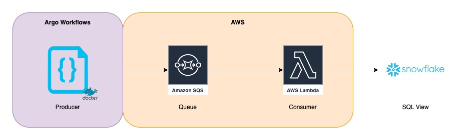

# ABI SQL View Generator

Generates second order data views.

## Architecture/Design

The design of this program is broken up into two parts: a producer that fetches ABIs from the database and generates the SQL `create view` statements and a consumer which pulls the SQL statements from a message queue and submits them to the database to be created. This design was chosen to improve throughput and concurrency as each contract can have its second order data view created as it becomes available via the message queue instead of each one being submitted in sequence.

The producer is a go program that is containerized and run as an argo workflow. The producer produces the SQL statements which are serialized along with other information and sent to an SQS message queue. The SQS queue then triggers a Lambda function which is also a go program that consumes and deserializes the message and submits the SQL statements to Snowflake to create the second order data views.

The producer code is dockerized and the image is pushed to an ECR repo which is then accessed by the argo workflow. The SQS queue and related AWS objects (i.e. roles, queue url, arn etc...) are managed by the data-pipeline terraform module in the devops repo. The lambda function is deployed from this repo using the [serverless](https://www.serverless.com/) framework.



## Local Development

There is currently no good way of testing the consumer code easily outside of an AWS environment but the code for that program is relatively simple in that it simply pulls a message from an SQS queue, deserializes it, and submits the SQL to Snowflake. The producer code however can be tested locally and run the following way:

```{bash}
go run cmd/producer/main.go -dry-run
```

Adding the `-dry-run` CLI option will run the code without actually submitting the message to the SQS queue.

The producer requires access to Snowflake to pull ABIs from the `deployed_contract_metadata` table and requires the following environment variables be set when running:

- SF_ACCOUNT
- SF_USER
- SF_PASSWORD
- SF_DATABASE
- SF_SCHEMA
- SF_WAREHOUSE
- SF_ROLE

## Templates/SQL Directories

The [templates](./templates/) directory contains go template files. These are SQL files that use go templating to interpolate Go struct data into the file as well as perform conditional logic sourced via optional CLI arguments. The [sql](./sql/) directory is for hosting static SQL files.
